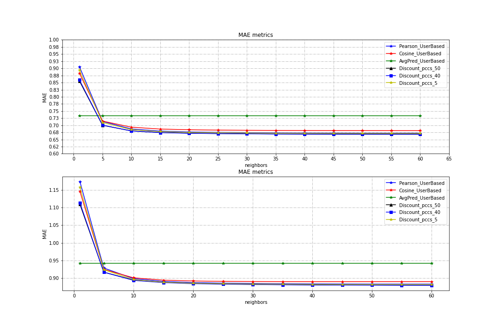
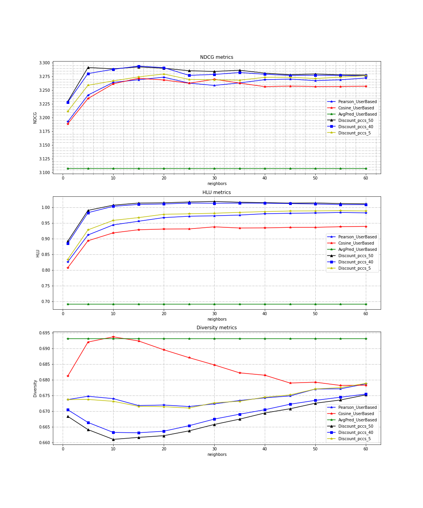
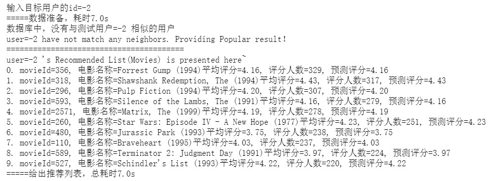
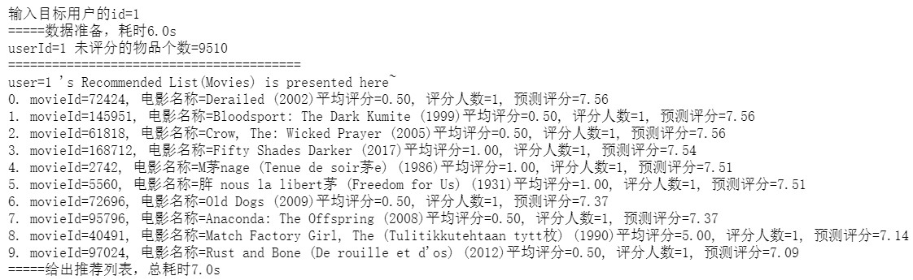

# 基于用户Pearson相似性的协同过滤（推荐算法）实现与验证

"Recommend System Experiment"     Author：荀镕基 1819660230    2021.11.25


---

## 简介

使用 **基于记忆的协同过滤算法**（基于用户、基于物品），预测用户对他未评分过的物品的评分。

### （1）目标

实现基于用户/物品的协同过滤算法，对评分记录 ratings.csv 数据[^1]，预测用户对某个电影的评分，

>[^1]:本实验数据： Movielens 数据集 [数据集介绍](.\docs\README_DataSet.md)

### （2）算法流程小结

- **Step 1：Data Preprocessing**
  
  1. 读入数据：评分数据 ratings、电影数据 items（物品）
  
     - 从评分数据中，提取用户 id，存入 user 集合；movieid 存入 movies
  
  2. 切块分组 （K-fold 交叉验证）
  
     1）使用 "评分记录" 在 ratings 中的行号，作为记录的标识，进行分块
     2）打乱评分记录的元素顺序
  
     > - 10 折交叉验证（分10块）：循环选取每 1 块用于测试，其余的 9 块的用于训练
     > - ratings.csv 中的评分记录，按 userid 从小到大排列，为了避免测试集只有一个用户，所以需要打乱顺序
  
  3. 用户两两配对 (u1, u2) ：用于计算两两用户之间的相似性
  
  

- **Step 2：Calculate the Similarity**

  > 10 折交叉验证（分10块）：循环选取每 1 块用于测试，其余的 9 块的用于训练
  >
  > 以某一种训练、测试分块情况，举例

  1. 数据准备

     1. 存储 "评分矩阵"

        > - 方案一、使用字典存储，key=user_id；value={"i1":3,"i2":4.5;...} 值是另一个字典
        > - 方案二、使用 numpy 矩阵存储

     2. 编写必要函数

        > - 获取某用户评分过物品 set 集合
        > - 获取（user，item）的评分

  2. 实现 "相似度计算" 的公式

     > - Pearson 相似度函数
     > - Cosine 相似度

  3. 计算相似度，存储到"相似度矩阵 similarity"

     > - 方案一、使用字典存储
     >   similarity_dict1={u : {v1: 0.29 , v2:0.8, ...}} 值： {v1:相似度值}字典

  4. 邻居排序：按相似度从大到小，对每个用户的所有邻居排序

     >neighbors：dict，{u:[(nb1,sim),(nb2,sim),...按sim从大到小], ...}

  

- **Step 3：Predict**

  1. 预测公式

  2. 计算训练集内所有用户平均评分

  3. 对 test 块的记录，预测评分

     > 1. 先对邻居初步筛选：选择的邻居，需要对预测的item评过分
     > 2. 在满足条件的邻居集合内，选择 K 个邻居
     > 3. 预测rui，预测结果存入 prediction 字典
     >    key=(user，item)，value=[预测评分，用户真实评分（测试集有真值）]


- **Step 4：Evaluation**

  1. 实现评价指标

     > 1. MAE、RMSE
     > 1. ROC曲线、PR曲线
     > 1. 排序指标：NDCG、HLU
     > 1. 多样性指标：Diversity

  2. 在不同邻居数量下测试，绘制对应曲线

  3. 比较不同算法的结果

     - Cosine 余弦相似度
     - Pearson相似度
     - Average_Predict 
     - Discount_factor Pearson

  

- **Step5：输入用户Id，给出推荐列表**

  > - 使用 DB 全部数据训练，在其余未看过的电影范围内推荐
  >
  >   > 所有这个用户的预测结果（邻居数量最优的情况下），以预测评分排序(降序)
  >
  > 物品名(电影名) 整体样本平均评分 评分人数 预测评分 真实评分
  > 物品名(电影名) 整体样本平均评分 评分人数 预测评分 真实评分
  > 物品名(电影名) 整体样本平均评分 评分人数 预测评分 真实评分
  >
  > 1. 先考虑将所有数据作为训练集
  > 2. 找出未评分的物品
  > 3. 预测

```flow
st=>start: 输入用户Id
cond_1=>condition: 有无相似用户？
cond_2=>condition: 看过全部电影？
cond_3=>condition: sifted neighbors num is 0?
end_1=>end: 给出流行性推荐列表（评分人数高的电影）

op_2=>operation: 对每个未看电影预测评分
cond_pred=>condition: 有邻居看过这个电影？
op_pred_1=>operation: 评分均值
op_pred_2=>operation: 预测公式
op_pred_func=>subroutine: 按预测分值从大到小排序，选择N个推荐
end_2=>end: 给出长度=N 的推荐列表


st->cond_1
cond_1(yes)->end_1
cond_1(no)->cond_2
cond_2(yes)->end_1
cond_2(no)->op_2->cond_pred
cond_pred(no)->op_pred_1->op_pred_func
cond_pred(yes)->op_pred_2->op_pred_func
op_pred_func->end_2

```


---

## 实验结果

**（1）比较不同CF算法下的MAE、RMSE指标**



- 分析： MAE、RMSE曲线在邻居数量=20后开始趋于稳定。1）邻居数量>=15时，Pearson CF算法的MAE、RMSE指标均低于Cosine余弦相似度的CF算法。2）对于Pearson 改进算法，当DiscountFactor=50时，Pearson CF算法的RMSE、MAE进一步降低到0.672，体现在计算Pearson 相似度时，增加折扣因子，降低共同物品数较低的用户对，其相似度对结果的权值，提升了模型预测效果。

**（2）NDCG、HLU、Diversity指标**



- 分析：

1. 在邻居数=[5，60]时，DiscountFactor=50 的Pearson CF算法，NDCG、HLU排序指标值相较于普通Pearson CF算法更好，因此折扣因子的改进提升了推荐列表的质量。

2. 对于推荐列表内容的多样性Diversity，DiscountFactor=50 的Pearson CF算法，比普通Pearson CF算法更差，体现了在进一步提升了预测准确性，会带来的多样性的减少。

**（3）输入用户id，给出推荐列表**

1. 新用户或没有邻居的用户：给出流行度推荐（评分人数最多）
   

2. 有邻居的用户：按预测评分从大到小选取 10 个
   


---

## Q&A

### 1.查看文件编码

> Q：使用 utf-8 编码读取 movies.csv 引发异常
>
> [参考](https://blog.csdn.net/qq_32618817/article/details/81363235?ops_request_misc=%257B%2522request%255Fid%2522%253A%2522163781849216780366531024%2522%252C%2522scm%2522%253A%252220140713.130102334..%2522%257D&request_id=163781849216780366531024&biz_id=0&utm_medium=distribute.pc_search_result.none-task-blog-2~all~baidu_landing_v2~default-1-81363235.first_rank_v2_pc_rank_v29&utm_term=pandas+UnicodeDecodeError&spm=1018.2226.3001.4187)

```
import chardet
def print_encoding(filename):
    with open(filename,'rb') as fp:
        print(chardet.detect(fp.read()))

print_encoding('./movies.csv')

#>>{'encoding': 'GB2312', 'confidence': 0.5078125, 'language': 'Chinese'}
```

​	对于中文字符的问题，我们已知底下的排序，按照编码方式包含的字符数的多少从少到多进行排序。因为GB2312编码的，我们可以试图用GBK或者更高的GB18030来打开。
**GB2312 < GBK < GB18030**

```
#解决：
items=pd.read_csv("movies.csv",sep=',',encoding="GBK")
```


- 注：test 每次计算一次相似性太慢》》csv 文件数据删掉一点


### 2.数据预处理

**（1）使用 `pandas.read_csv()`读取数据**

```python
#1）读取评分数据: columns=[userId  movieId  rating  timestamp]
ratings=pd.read_csv("ratings.csv") #读入为<class 'pandas.core.frame.DataFrame'>
print(ratings.head(5)) #查看开头5行数据
print(ratings.index,'\n',ratings.columns)#行列索引
```

**（2）分割 train, test set**


## License

This project is licensed under the MIT license (MIT)
